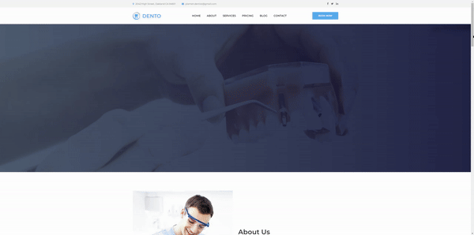

# Dental_Clinic_Website

Check the website LIVE: https://dental-clinic-website.onrender.com/

NOTE: When you access the website bear in mind that this is Render's free instance which means it will most likely spin down with inactivity, which can delay requests by 50 seconds or more.

This project was my first web app in django. It took some time to get to know the intricacies of the settings.py file and the whole folder structure in general but in the end it all worked out.

The main issue with my first deploy configuration was the inability of my script to output all the staticfiles. The reason being was that in the messy folder strucuture I've created the path to staticfiles was non existent.

This was also yet another type of deployment, this time to a free web hosting service called Render (no more Heroku for me).

Plenty of the site's functionality is just placeholder. The main learning curve was being able to deploy yet another language + framework to yet another platform. Also, working with html/css/js templates is quite chill.

